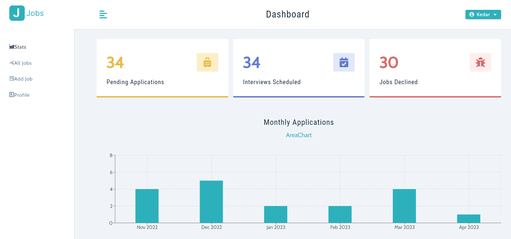
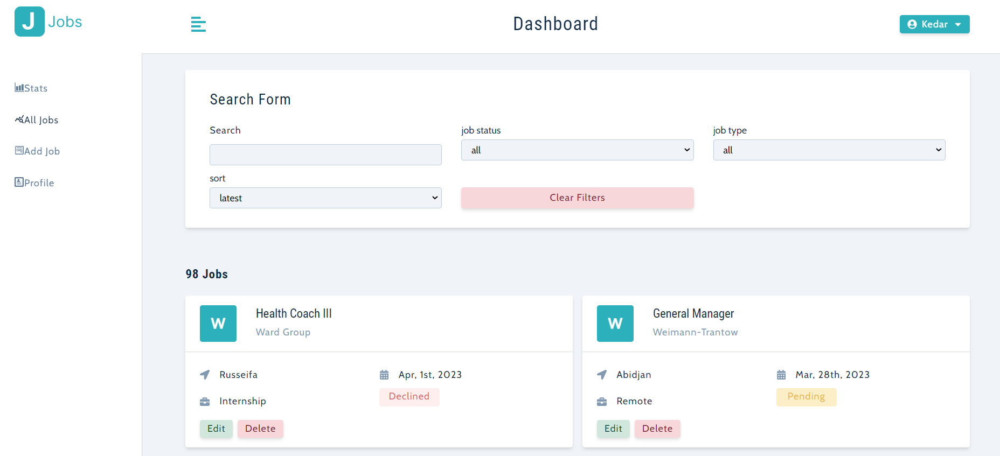

# Jobs

## Table of Contents
* [Overview](#overview)
* [Project Screenshot](#screenshots)
* [References](#references)
* [Author](#author)

# Overview
As a job seeker, I often find it challenging to keep track of my job applications. That's why I decided to build a web application that will help me track all my job applications in one place. I will be using the MERN (MongoDB, Express, React, and Node.js) tech stack to build the Job Application Tracker.

With this application, I will be able to create an account, log in, and log out of the application. I will also be able to create a job application by filling in a form with details such as job title, company name, job description, application date, application status, and other relevant information. The application will have a dashboard that displays a summary of all my job applications, such as the number of applications, status of applications, and a timeline of application dates.

I will be able to view, edit, and delete my job applications. The list of job applications will be displayed in a tabular format and can be sorted based on various parameters such as application date, job title, and company name. I will also be able to search for job applications using keywords such as job title or company name.

Furthermore, I will receive notifications about the status of my job applications. For example, I will receive a notification when my application status changes or when I am invited for an interview.

For building the Job Application Tracker, I will be using MongoDB as the database for storing job application details, Express.js as the backend framework for handling HTTP requests and responses, React.js as the frontend library for building user interfaces, and Node.js as the backend runtime environment for running JavaScript on the server. I will be using JSON Web Tokens (JWT) for secure authentication and authorization. Finally, I will deploy the application on Heroku, a deployment platform for hosting the application.

By building the Job Application Tracker using the MERN tech stack, I will be able to demonstrate my full-stack development skills, which include backend development, frontend development, database management, and deployment.

## Screenshots

### You can watch Live demo [_here_](https://jobs-mv74.onrender.com).

## References
- [styled-components](https://styled-components.com/)
- [React](https://reactjs.org/docs/getting-started.html)
- [Node](https://nodejs.org/en)
- [Express](https://expressjs.com/)
- [MongoDB](https://www.mongodb.com/)

## Author

[Website](https://kedarmakode.com/)

[Linkedin](https://www.linkedin.com/in/kedar-makode-9833321ab)

[Twitter](https://twitter.com/Kedar__98)

[Instagram]()

kedarmakode1598@gmail.com

